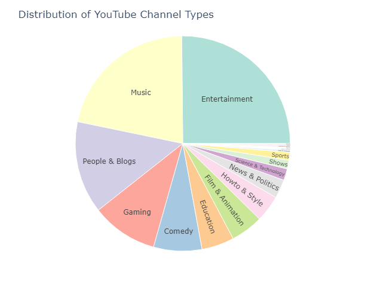

# **Data Analysis Youtube**

## **Aim/Objectives**

- Plot the top __10 youtube channels__ by number of suscribers and group it by the category (Example- music , education , etc)

## **Requrements (installations packages)**
- __Numpy__ 
- __Pandas__ 
- __Matplotlib.pylab__ 
- __Seaborn__ 
- __Plotly.express__ 
- __FuncFormatter__

## **Procedure**

- **Step 1** -  Reading the Global YouTube Statistics csv file.
- **Step 2** -  Checking rows and columns , Seeing top 5 rows and making logic.
- **Step 3** -  Removing unwanted columns.
- **Step 4** -  Converting subscribers column to numeric .
- **Step 5** -  Capitalising columns.
- **Step 6** -  Removing duplicate rows.
- **Step 7** -  Plotting Sunburst chart for Distribution of YouTube Channel Type.
- **Step 8** -  Creating Function Formatter for y axis (Millions).
- **Step 9** -  Making query for catagory
- **Step 10** - Plotting Top 10 YouTube Channel according to catagory.

## **Observations**
- **First 5 Rows in Global YouTube Statistics csv file**

| rank | Youtuber                   | subscribers | video views | category         | Title                      | uploads | Country       | Abbreviation | channel_type  | video_views_rank |
| ---- | -------------------------- | ----------- | ----------- | ---------------- | -------------------------- | ------- | ------------- | ------------ | ------------- | ---------------- |
| 1    | T-Series                   | 245000000   | 2.28E+11    | Music            | T-Series                   | 20082   | India         | IN           | Music         | 1                |
| 2    | YouTube Movies             | 170000000   | 0.00E+00    | Film & Animation | youtubemovies              | 1       | United States | US           | Games         | 4055159          |
| 3    | MrBeast                    | 166000000   | 2.84E+10    | Entertainment    | MrBeast                    | 741     | United States | US           | Entertainment | 48               |
| 4    | Cocomelon - Nursery Rhymes | 162000000   | 1.64E+11    | Education        | Cocomelon - Nursery Rhymes | 966     | United States | US           | Education     | 2                |
| 5    | SET India                  | 159000000   | 1.48E+11    | Shows            | SET India                  | 116536  | India         | IN           | Entertainment | 3                |

- ### **Distribution of YouTube Channel Types**
  

- ### **Top 10 Youtube Channels in Entertainment**
 

- ### **Top 10 Youtube Channels in Music**
 

- ### **Top 10 Youtube Channels in People & Blogs**
  

- ### **Top 10 Youtube Channels in Games**
 

- ### **Top 10 Youtube Channels in Comedy**
 

- ### **Top 10 Youtube Channels in Education**
 

- ### **Top 10 Youtube Channels in Film_Animation**
 

 ## **Conclusion**
 - Plot the top __10 youtube channels__ by number of suscribers and group it by the category was successfully implemented.
